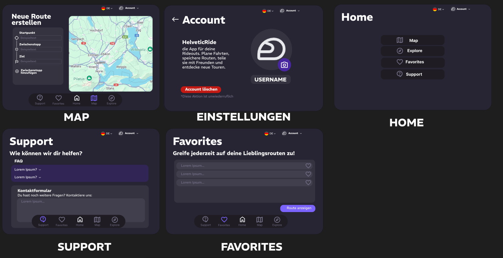
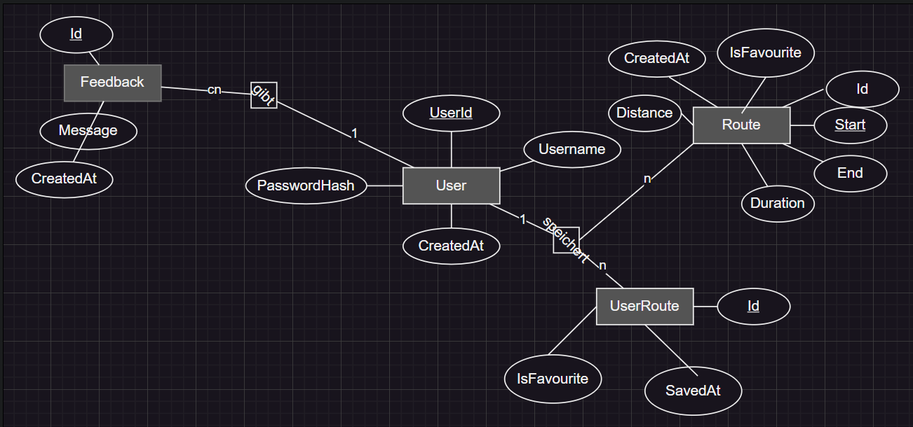
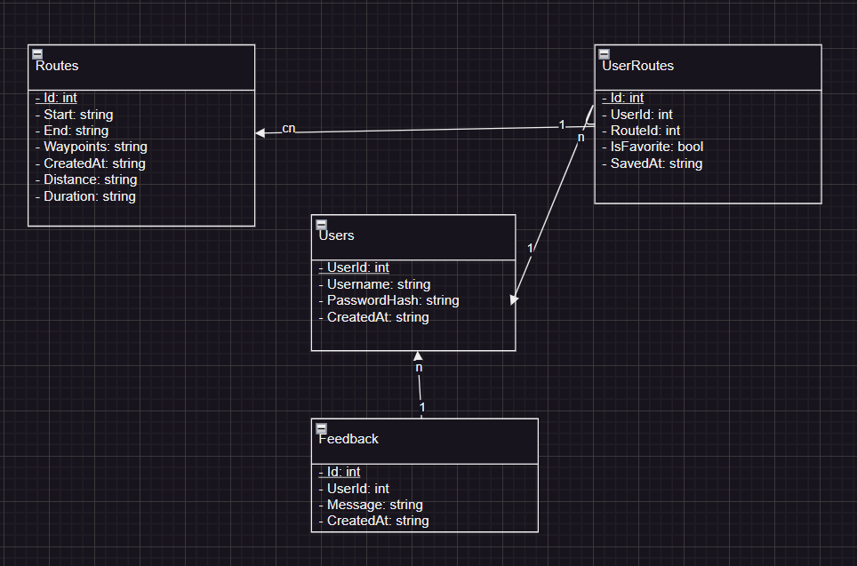

# 🏍️ HelveticRide – Dein persönlicher Routenplaner

**HelveticRide** ist eine moderne WPF-Anwendung zur Verwaltung und Visualisierung von Motorradrouten in der Schweiz. Das Projekt wurde im Rahmen eines Semesterprojekts entwickelt und vereint objektorientierte Programmierung, Datenbankmanagement und UI-Design.

---

## 📺 Video zum Projekt auf Youtube 

[](https://youtu.be/a01sl-0EDG8)

---

## 📌 Projektübersicht

- **Sprache:** C# (.NET)
- **Technologie:** WPF mit SQLite
- **Themen:** Benutzerverwaltung, Routenspeicherung, Favoriten, Feedback
- **Zielgruppe:** Motorradfahrer:innen & Tourenliebhaber:innen

---

## 🔧 Funktionen

- ✅ Benutzerregistrierung & Login
- ✅ Routen speichern, anzeigen, favorisieren
- ✅ Web-basierte Kartendarstellung mit WebView2
- ✅ Feedbackfunktion für User-Feedback
- ✅ Beispielrouten über SQL-Datei importierbar
- ✅ Datenbankverbindung via Singleton
- ✅ Trennung von Logik und Datenmodell

---

## 🗃️ Datenbankstruktur

Die Anwendung nutzt eine SQLite-Datenbank mit folgenden Tabellen:

- **Users** – speichert registrierte Benutzer
- **Routes** – speichert Routeninformationen
- **UserRoutes** – verbindet Nutzer und Routen
- **Feedback** – speichert Rückmeldungen

Die Struktur wird automatisch beim Start anhand der Datei [`create_tables.sql`](create_tables.sql) erstellt.

---

## 🧪 Beispielrouten importieren

Optional kann die Datei [`sample_routes.sql`](sample_routes.sql) bereitgestellt werden. Diese Datei wird beim Start automatisch ausgeführt, sofern sie vorhanden ist.

---

## 🖼️ Diagramme

Die folgenden drei Grafiken müssen als Teil der Projektdokumentation erstellt und im Git-Repo abgelegt werden:

1. **ER-Diagramm**  
   

2. **Relationales Modell**  
  

3. **UML-Klassendiagramm**  
   

---

## 🧭 Programmstart

```bash
dotnet build
dotnet run
```

Stelle sicher, dass sich `create_tables.sql` im Output-Verzeichnis (`bin/Debug/...`) befindet.

---

## 📁 Projektstruktur (Auszug)

```
helveticride/
│
├── create_tables.sql
├── sample_routes.sql         # Optional
├── Database.cs               # Zentrale Datenbanklogik
├── LoginWindow.xaml
├── RegisterWindow.xaml
├── MapPage.xaml
├── RoutesWindow.xaml
└── ...
```

---

## 📜 Anforderungen (Modulübersicht)

| Modul | Thema                                | Umsetzung                   |
|--------|--------------------------------------|-----------------------------|
| 106    | Datenbankzugriffe                   | ✅ CRUD in `Database.cs`    |
| 162    | Datenmodellierung                   | ✅ ER & Relationalmodell geplant |
| 164    | Datenbank-Skripte                   | ✅ `create_tables.sql`      |
| 319    | Applikationsdesign                  | ✅ Klassenstruktur vorhanden|
| 320    | OOP / Vererbung / Polymorphismus    | ✅ durch Datenmodelle       |
| 322    | UI/UX & Validierung                 | ✅ WPF mit Eingabeprüfungen |

---

## 🖊️ Mockup



---

## 🧩 ER-Modell



---

## 🗂️ Relationales Modell



---
